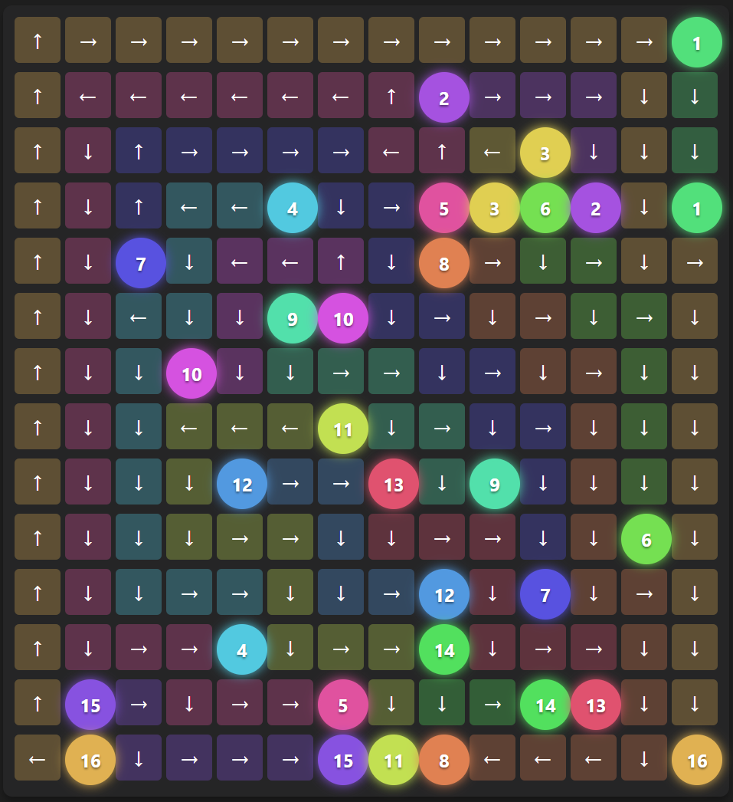

# Reconnecting the Network (BESTEMv14)

A visual coding challenge platform designed to test and visualize pathfinding algorithms. The goal is to connect matching rune pairs on a grid without paths overlapping or crossing.

> **Note:** This project was inspired by the "Reconnecting the Network" challenge from the **BESTEM V14 Phase 1 Preselection**. I decided to expand it into a full-featured visualization tool for my GitHub portfolio.

<p align="center">
  
</p>

## 🎮 Features

- **Interactive Visualizer**: Watch your algorithm's paths come to life on the grid.
- **Multi-Language Support**: Write solutions in **Java**, **Python**, or **C++**.
- **Level Editor**: Create and save your own custom test cases.
- **Batch Testing**: Run your solution against all available test cases in one click.
- **Performance Metrics**: Analyze your solution's efficiency with metrics for Path Length, Turn Count, and Optimality (vs Manhattan distance).
- **Code Snapshots**: Save and restore versions of your code to safely experiment with optimizations.

## 🚀 Getting Started

### Prerequisites

- **Python 3.x**
- **Java JDK** (if using Java)
- **G++ / MinGW** (if using C++)

### Installation

1.  Clone the repository or download the source code.
2.  Install the required Python dependencies:

    ```bash
    pip install flask
    ```

3.  Ensure your input/output directories are set up correctly in `server.py` if they differ from the default.

### Running the Application

1.  Start the Flask server:

    ```bash
    python server.py
    ```

2.  Open your web browser and navigate to:

    ```
    http://localhost:5000
    ```

## 🧩 Problem Statement

**The Task:**
Given a grid with paired arcane runes, calculate valid, non-overlapping paths to connect each pair.

**Constraints:**
-   Grid dimensions up to 14x14.
-   Paths cannot share cells.
-   Paths cannot cross each other.
-   Each rune ID appears exactly twice (start and end).

**Input Format:**
A stream of integers: `rows cols n_pairs [rune_id node_index]...`

**Output Format:**
```text
<number_of_channels>
<origin_index> <num_steps> <direction_1> <direction_2> ...
```

## 🛠️ Project Structure

-   **`server.py`**: Flask backend handling API requests, file operations, and code execution.
-   **`static/`**: Frontend application.
    -   `index.html`: Main UI layout.
    -   `script.js`: Application logic, visualization, and editor integration.
    -   `style.css`: Styling and themes.
-   **`input/`**: Directory containing `.txt` test case files.
-   **`output/`**: Directory containing expected output files (optional).
-   **`Solution.java`**: A reference model solution (Java) that implements an optimized backtracking algorithm with heuristics to solve the challenges, including the edge cases in Test 5 and 7.

## ⌨️ Controls

-   **Ctrl/Cmd + Enter**: Run the current code.
-   **Play/Pause**: Control the visualization animation.
-   **Slider**: Scrub through the pathfinding steps.
-   **Snapshots (📷)**: Save the current state of your code.

## ⚠️ Known Issues / Special Cases

-   **Test Case 05 (`input05.txt`)**: The provided expected output (`output05.txt`) contains an invalid path. The path for Rune 2 passes through index 57, which is occupied by Rune 5.
-   **Test Case 06 (`input06.txt`)**: This test case contains a deliberate "mistake" where a rune pair has mismatched IDs (7 and 8). The validator treats this as a valid connection between two singleton runes.

## 📊 Test Results

| Test Case | Status | Time | Message | Actual Output | Expected Output |
| :--- | :--- | :--- | :--- | :--- | :--- |
| input00.txt | PASS | 735ms | All paths valid | 5<br>0 5 S S S S E<br>2 4 W S S S<br>4 4 W S S S<br>7 3 S S S<br>9 4 S S S W | 5<br>0 5 S S S S E<br>2 4 W S S S<br>4 4 W S S S<br>7 3 S S S<br>9 4 S S S W |
| input01.txt | PASS | 765ms | All paths valid | 5<br>0 5 S E E E E<br>1 13 E E E E S S S S S W W W W<br>16 7 W W W W S S S<br>19 4 E E E S<br>25 2 E E | 5<br>0 5 S E E E E<br>1 13 E E E E S S S S S W W W W<br>16 7 W W W W S S S<br>19 4 E E E S<br>25 2 E E |
| input02.txt | PASS | 781ms | All paths valid | 6<br>4 3 S S S<br>5 5 S S S S S<br>7 7 E S S S S E E<br>13 4 S S S W<br>15 9 N N W W W S S S S<br>21 2 S E | 6<br>4 3 S S S<br>5 5 S S S S S<br>7 7 E S S S S E E<br>13 4 S S S W<br>15 9 N N W W W S S S S<br>21 2 S E |
| input03.txt | PASS | 739ms | All paths valid | 7<br>4 8 E E S S S S S S<br>8 2 E S<br>15 16 W N N E E E S E E S S W S S S W<br>18 7 W S S W W S S<br>23 5 W W S S S<br>33 2 S S<br>38 2 W S | 7<br>4 8 E E S S S S S S<br>8 2 E S<br>15 16 W N N E E E S E E S S W S S S W<br>18 7 W S S W W S S<br>23 5 W W S S S<br>33 2 S S<br>38 2 W S |
| input04.txt | PASS | 773ms | All paths valid | 6<br>0 3 S S S<br>18 3 W S S<br>20 16 N N W W W W W S S S S W S S E E<br>25 2 S S<br>30 12 N N N E E E S S E S S S<br>33 7 S S W W N W W | 6<br>0 3 S S S<br>18 3 W S S<br>20 16 N N W W W W W S S S S W S S E E<br>25 2 S S<br>30 12 N N N E E E S S E S S S<br>33 7 S S W W N W W |
| input05.txt | FAIL | 3807ms | Count mismatch: Got 0, Expected 6 | 0 | 6<br>6 4 E S S S<br>10 20 W S S S S S S E E E E E N N W N W N W N<br>11 10 E S E S E S E S S S<br>18 5 S S S S E<br>22 15 N W N W W W W W S S S S S S S<br>35 4 S E S E |
| input06.txt | PASS | 1388ms | All paths valid | 7<br>4 10 E E E S S W W S S E<br>9 4 S S S S<br>10 8 S E E S S S E E<br>14 12 W W W N W W W S S S S S<br>26 12 E S S S E E E E N N N W<br>34 4 S S W W<br>56 7 E E E E E E E | 7<br>4 10 E E E S S W W S S E<br>9 4 S S S S<br>10 8 S E E S S S E E<br>14 12 W W W N W W W S S S S S<br>26 12 E S S S E E E E N N N W<br>34 4 S S W W<br>56 7 E E E E E E E |

## 📝 License

This project is for educational purposes.
